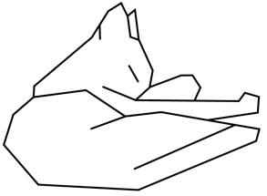
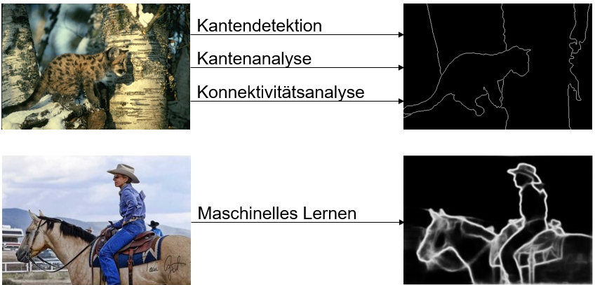
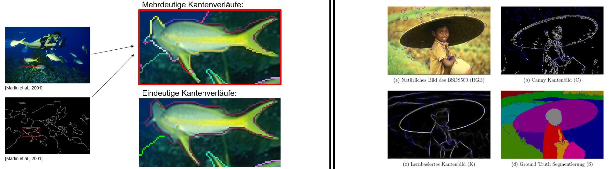
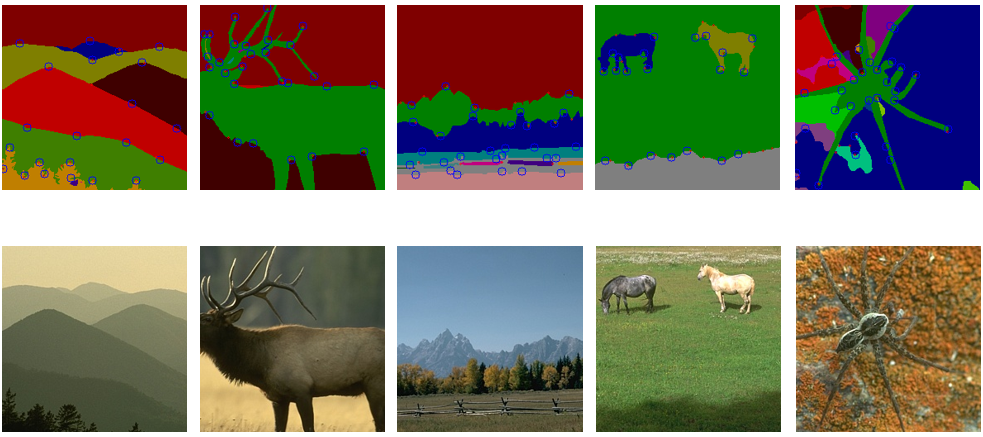
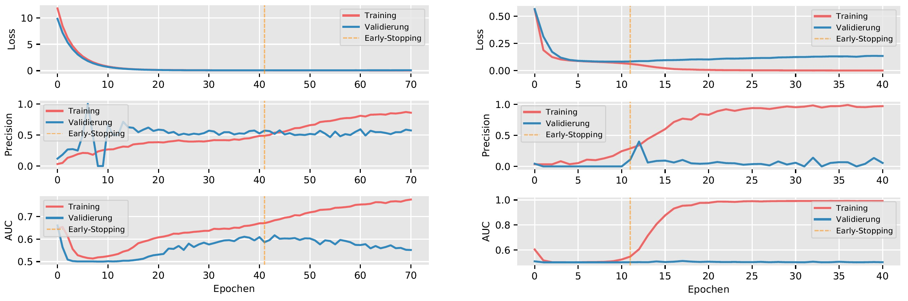
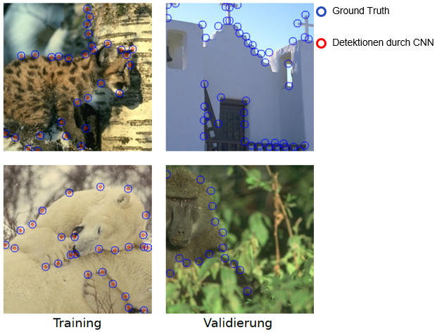

# Direct Detection of Local Shape Features Using Convolutional Neural Networks
This work investigates the detection of shape-based keypoints in natural images with CNNs. Here, keypoints are represented as curvature extrema along closed-contour shapes of objects. 

This repo mainly serves as a summary of the conducted work. Documentation was carried out in German. 

## Why Consider Shape Features for Object Detection?

*Shape*-based features and *view*-based (*texture*-based) features are inherently different feature types. As such, they complement eachother and using both can lead to more robust object detection methods. 

The above image shows *Attneave's Cat* which is well known in cognition theory. In the image, simply by connecting curvature maxima with straight lines, the object is easily recognizable. This is one example to illustrate how maximum curvatures are salient cues in visual perception.

## Edge Detection and Refinement

In order to be able to trace edges and to detect curvature extrema, high quality edge images are required. After determining edges in natural images, further cumbersome preprocessing steps are required: Essentially, edges have to be 1 px wide and must depict unambiguous as well as continuous object contours (see below). Even established edge detection methods cannot meet these requirements. In order to overcome the need for edge refinement in particular, a *direct* Deep Learning-based detection approach is explored. 

## Dataset Creation

For this work, a dataset consisting of natural images and corresponding keypoint maps detailing curvature extrema positions had to be created. For this purpose, the [Berkeley Segmentation Dataset (BSDS-500 Dataset)](https://www2.eecs.berkeley.edu/Research/Projects/CS/vision/bsds/) served as an appropriate starting point. To create the BSDS-500, hand-labeled segmentations from human subjects were collected by the authors. This already satisfied most mentioned criteria.
 
In particular, the dataset provided edge images with 1 px wide edges depicting continuous object contours. Finally, as part of the thesis, these annotations were manually revised so that curvature extrema could be detected with an internal method and ultimately to create training data for CNNs. 

As depicted in the above image (left side example), a thorough revision of the provided annotations was necessary to dissolve ambiguities of contours in order to enable the detection of curvature extrema. In total, 200 images were revised so that 160 images were used for training and 40 for validation.    
As a final step, along using the unedited input images, different versions were created by applying simple preprocessing methods, such as Canny Edge Detection, DL-based Edge Detection, and using segmentation data. The above image (right side example) shows the different image types together with extracted keypoints, depicted as circles. Circle size represents scale information. While being an important property, the scale of keypoints is neglected so that only the determination of keypoint positions is considered in this work. 

## Context on Implementation
Since literature on Deep Learning-based detection of **shape-based** keypoints (curvature extrema) is non-existent, many of the approaches developed in this work, besides being inspired by existing works on **view-based** keypoints, also required a high level of exploration, systemic problem-solving as well as creativity to some extent. 

Following reviewed methods on view-based keypoint detection, two general approaches come into question to design a shape-based detector: **(1) Regression of Score Maps** or **(2) Binary Classification (*2-Class Segmentation*) of Keypoint Maps**. 
 
Due to the extremely sparse nature of curvature extrema as keypoints however, common regression loss functions such as MAE, MSE, etc. would not be sufficiently indicative for the training of neural networks. For this reason, the regression approach was discarded and the problem was instead viewed as an Imbalanced Binary Classification Problem (which inherently has an extreme imbalance of >99% Non-Keypoints vs. <1% keypoints for any image). 

## Evaluation

Initially, extensive tests with different selected CNN-based network architectures, namely [Key-Net](https://arxiv.org/abs/1904.00889), [SuperPoint](https://arxiv.org/abs/1712.07629), and [U-Net](https://arxiv.org/abs/1505.04597) were conducted. Using the [TensorFlow](https://www.tensorflow.org/) Python library, the networks were re-implemented, because existing implementations were not compatible. 

Among others, the testing phase revolved around systematically exploring the following possibilities with various experiments: 
- Modification of network architectures w. r. t. network size and deepness.
- Several loss functions and learning rates. Ultimately, the *Weighted Cross Entropy Loss* yielded the best results, as it provides a hyperparameter to assign a higher weight to the underrepresented class (keypoints) during training.
- Different means of preprocessing, including variations of input image types (as mentioned above).
- Using *hand crafted image features* such as gradient-based features (first and second order derivatives).
- Considering a minimal distance threshold for correct predictions. That is, any prediction within range of a keypoint is considered correct. 
- Artificially increasing training data by using data augmentation techniques.
- Since the dataset is very small, overfitting issues had to be combatted with various regularization methods. These include reducing model capacity (number of parameters), Dropout, L1- and L2-Regularization, and finally using Transfer Learning with a pre-trained (ImageNet) encoder.

Following these tests, a U-Net (Encoder-Decoder) architecture was selected and further experimented upon. 

### Qualitative Results

## Further Details

### Learning Curves

To evaluate the implemented approaches, two performance metrics were considered as criteria for network predictions being directly usable for object matching purposes: Precision and AUC. High Precision is favored to indicate high quality of detections (detected keypoints being true positives). However, Precision alone does not allow for a clear evaluation, because it does not consider the total amount of detected keypoints (a single true positive results in perfect Precision). Therefore as a measure for general good accuracy, additionally the AUC metric is considered, where a high AUC (high Recall) indicates that many of the keypoints are indeed detected. However, this does not take into account the amount of detected irrelevant points, which is not favorable for matching purposes for similar reasons. This duality emphasizes the need to consider both Precision and AUC together. 

The above figure depicts two typical learning scenarios encountered during evaluation:

- **Left Side:** The learning behavior of the networks initially exhibits comparably high AUC values due to a high Recall, indicating image-independent detections of keypoints of which *some* coincidentally represent true positives. The declining and subsequently increasing AUC suggests a continuous refinement of predictions, which is confirmed by a simultanously increasing Precision. Conversely, a sharp drop in Precision can be observed during the first epochs for validation data. This can be misleading, as the AUC suggests that network predictions are highly inaccurate during this interval.
  
- **Right Side:** The learning curves serve as an example for overfitting as mentioned: nearly perfect predictions for training data, but no correct keypoint detections for validation data. This is observable in the image example below as well. 

### Example Predictions for Overfitting

## Final Remarks on View-Based vs. Shape-Based Keypoints

Shape-based keypoint detection suffers from strong positional restrictions compared to view-based keypoints:
- To detect shape-based keypoints, at first object shapes must be retrieved (at least implicitly) and only then curvature extrema dictate keypoint positions. Partly as a result from this, such keypoint maps are very sparse and a keypoint detector may not effectively learn the necessary patterns to be sufficiently reliable.   

- To detect view-based keypoints however, only one basic condition has to be fulfilled. That is, keypoints must be repeatedly detectable for different image transformations (they must be distinct). There are no explicit restrictions for view-based keypoint positions. Resulting keypoint maps are much denser and the creation of rich training data is easier compared to shape-based keypoints which is favorable for the training of detectors.

Therefore, an approach that combats the sparsity of shape-based keypoint maps can further be investigated. However it is not clear how this can be achieved without discarding fundamental properties of shape-based keypoints. Perhaps the positional restrictions imposed on shape-based keypoints could be slightly relaxed. Instead of considering single-point positions, small weighted regions centered around keypoints (and possibly by combining this with a Regression approach) could be benefitial, as this approach could provide richer training data. 
